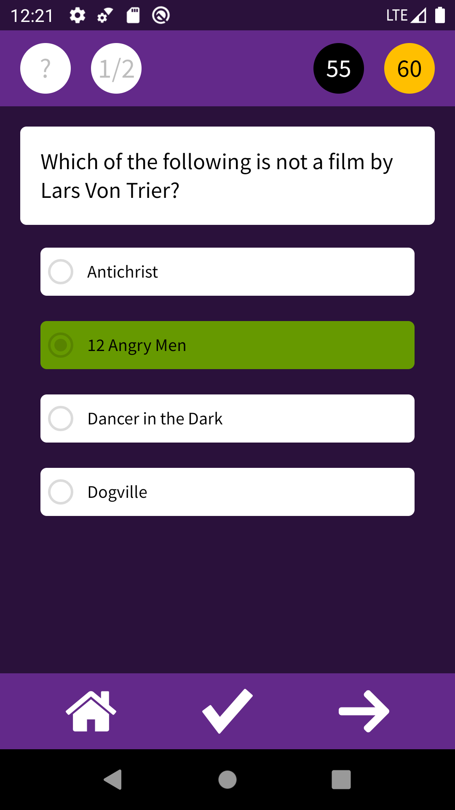

# Trivia Quiz
This was one of my first projects in Google-Udacity Android Basics Challenge program. It is trivia-kind of quiz. I had learned playing with visibilities, making animations, running a countdown timer and dealing with the state of all those during rotation. 

I later refactored this project to practice MVP pattern, Dagger2 and testing. 

  
   

  
   

